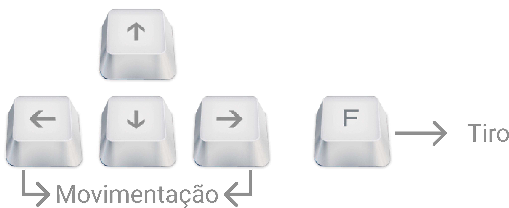

# **Space Mission**


> Atividade em equipe onde temos que desenvolver um jogo para compor nota para a matéria de LPC

## Progresso 📊

**Issues resolvidas:** `0%` (0/6)

## Executando o jogo 🚀

### Pré-requisitos 💻

Antes de começar, você precisa ter instalado no seu computador as ferramentas:
* [Git](https://git-scm.com/)
* [Python](https://www.python.org/)
* [Biblioteca Pygame](https://www.pygame.org/wiki/GettingStarted)

### Instalando **Space Mission** 📲

Para instalar o **Space Mission**, siga estas etapas:

```
# Clone o repositório para o seu computador
$ https://github.com/tmmarquess/Atividade005-LPC.git

# Navegue para a pasta do código
$ cd Atividade005-LPC

# Execute o programa
$ python main.py
```

## Jogabilidade 👾

### Contexto 📑
O mundo está prestes a ser destruído por uma chuva de asteroides, e a única forma de salvá-lo é embarcar na nave espacial e impedir que os asteroides colidam com a terra.

### Missão 🎯
Destruir os asteroides que entrarem no seu caminho e obter a maior pontuação possível

### Controles  🎮
  


## Como contribuir? 🤔


Para contribuir com o jogo, siga estas etapas:

1. Faça um fork deste repositório.
2. Faça o clone deste fork localmente
3. Faça suas alterações e confirme-as: `git commit -m '<mensagem de commit>'`
4. Envie para o repositório remoto: `git push`
5. Crie a pull request.

Para saber mais sobre como fazer um pull request, consulte a documentação do GitHub em [como criar um pull request](https://help.github.com/pt/github/collaborating-with-issues-and-pull-requests/creating-a-pull-request).

## Colaboradores 🤝🏼

<table>
  <tr>
    <td align="center">
      <a href="#">
        <br>
        <sub>
          <a href="https://github.com/tmmarquess">Thiago Marques</a>
        </sub>
      </a>
    </td>
    <td align="center">
      <a href="#">
        <br>
        <sub>
          <a href="https://github.com/DiogoRezen">Diogo Rezende</a>
        </sub>
      </a>
    </td>
    <td align="center">
      <a href="#">
        <br>
        <sub>
          <a href="https://github.com/SarahPortelaSalehi">Sarah Salehi</a>
        </sub>
      </a>
    </td>
    <td align="center">
      <a href="#">
        <br>
        <sub>
          <a href="https://github.com/Guilherme-LTS">Guilherme Teixeira</a>
        </sub>
      </a>
    </td>
    <td align="center">
      <a href="#">
        <br>
        <sub>
            <a href="https://github.com/igormqs">Igor Marques</a>
        </sub>
      </a>
    </td>
  </tr>
</table>

## 📝 Licença

Esse projeto está sob a licença`MIT`. Veja o arquivo [LICENÇA](LICENSE) para mais detalhes.

[⬆ Voltar ao topo](#space-mission)<br>